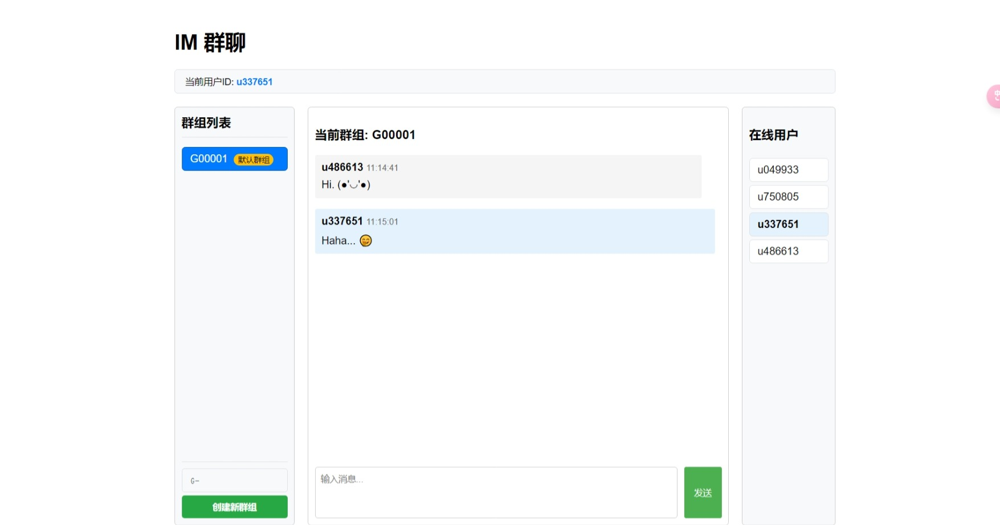

# My IM

一个基于 Netty 实现的简单即时通讯系统，支持群组聊天和在线用户显示。

## 功能特点

- 用户登录：不需登录，进入页面默认分配用户ID
- 群组管理：可创建和加入多个聊天群组
- 实时通讯：基于 WebSocket 的即时消息发送和接收
- 在线用户：实时显示当前群组的在线用户列表
- 消息记录：消息不做任何存储，前端使用了SessionStorage
- 多行文本：支持发送多行消息（Shift + Enter 换行）

## 技术栈

- 后端：
    - Spring Boot 2.7.0
    - Netty 4.1.86.Final
- 前端：
    - JavaScript
    - HTML
    - CSS
    
## 效果图

## 注意事项

- 本项目仅用于学习和演示目的
- 消息不做任何存储
- 建议在现代浏览器中运行以获得最佳体验

## 许可证

[MIT License](LICENSE)